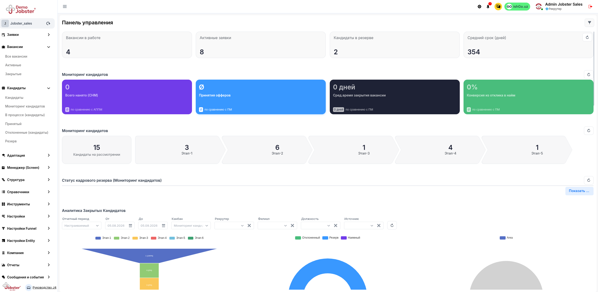
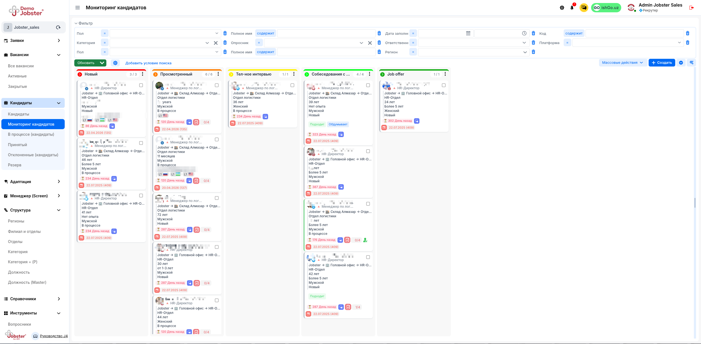
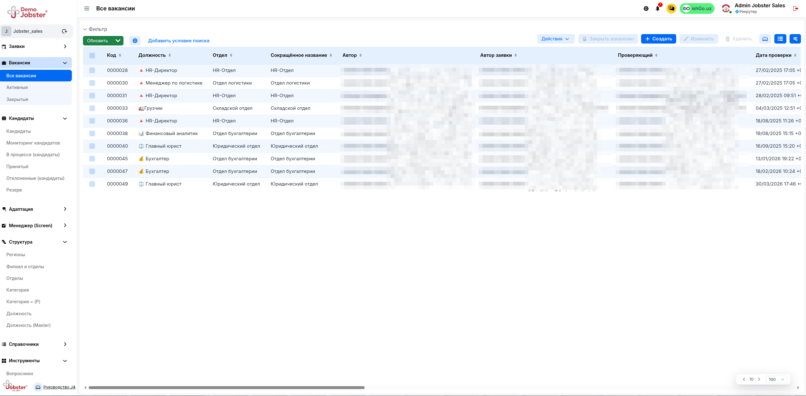
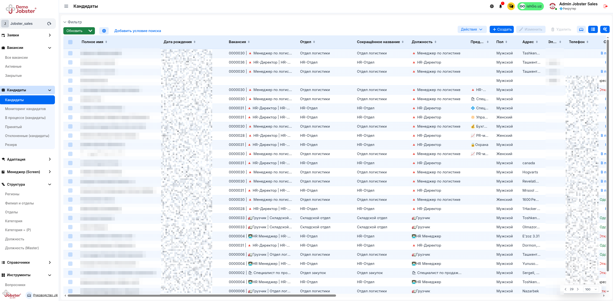
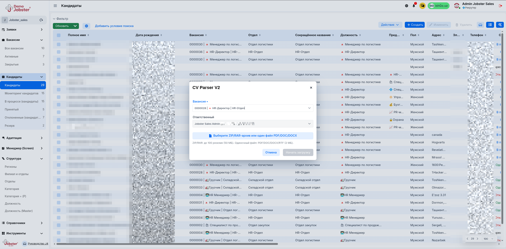
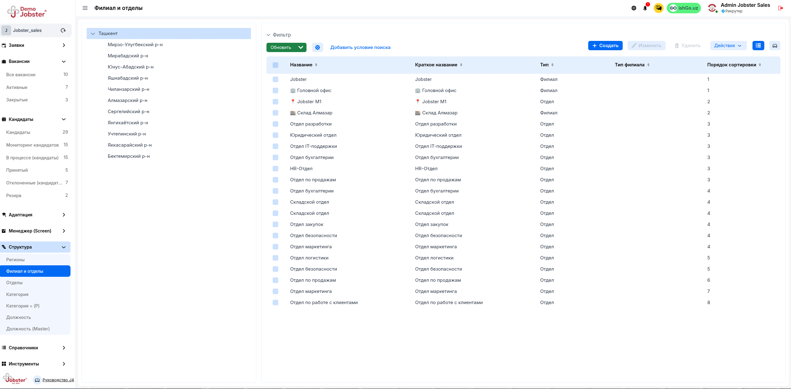
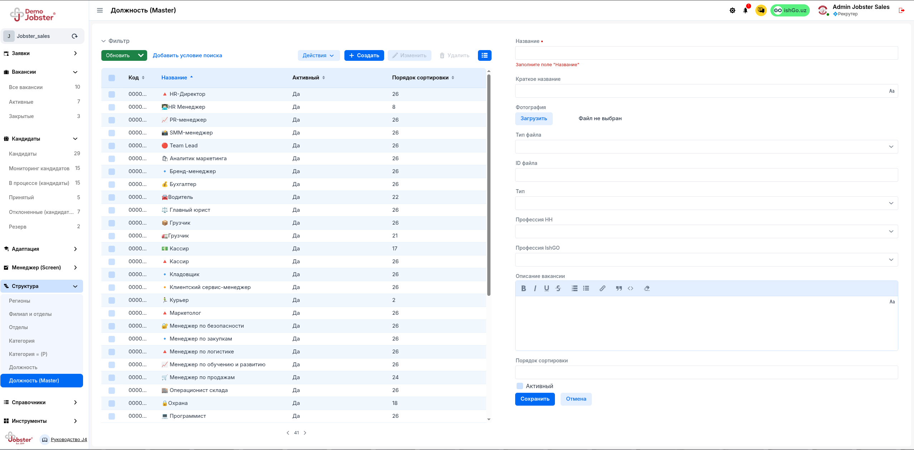
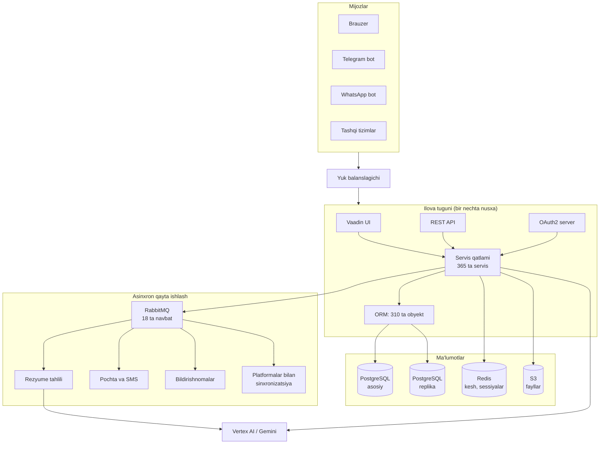
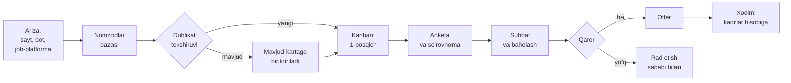
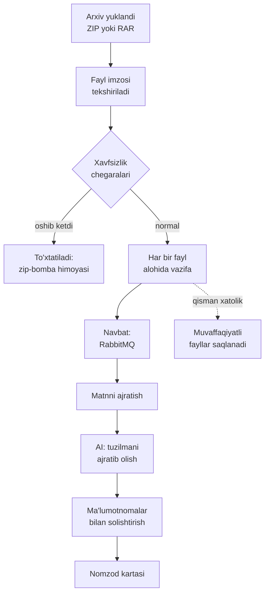

**O'zbekcha** | [Русский](README.ru.md)

# Jobster 4.0

**O'zbekiston uchun to'liq tsiklli HR platformasi: nomzod tanlashdan kadrlar
hisobi va analitikagacha.**

Jobster sanoat ekspluatatsiyasida ishlaydi va filial tarmog'iga ega yirik
kompaniyalarga xizmat ko'rsatadi. Tizim uch tilda (o'zbek, rus, ingliz)
ishlaydi, mahalliy job-platformalar, SMS-provayderlar va davlat talablarini
hisobga oladi.

Texnologiyalar: Java 21, Spring Boot, Jmix 2.x, Vaadin, PostgreSQL,
RabbitMQ, Redis, Google Vertex AI.

---

## 1. Mundarija

1. [Mundarija](#1-mundarija)
2. [Ekran suratlari](#2-ekran-suratlari)
3. [Imkoniyatlar](#3-imkoniyatlar)
4. [Nima uchun mahalliy platforma kerak](#4-nima-uchun-mahalliy-platforma-kerak)
5. [Arxitektura](#5-arxitektura)
6. [Asosiy jarayonlar qanday ishlaydi](#6-asosiy-jarayonlar-qanday-ishlaydi)
7. [Ko'p ijarachilik va xavfsizlik](#7-kop-ijarachilik-va-xavfsizlik)
8. [Integratsiyalar](#8-integratsiyalar)
9. [Ko'lam va muhandislik ko'rsatkichlari](#9-kolam-va-muhandislik-korsatkichlari)
10. [Xorijiy ATS tizimlari bilan taqqoslash](#10-xorijiy-ats-tizimlari-bilan-taqqoslash)
11. [Ushbu repozitoriyda nima e'lon qilingan](#11-ushbu-repozitoriyda-nima-elon-qilingan)
12. [Hakamlar hay'ati uchun kirish](#12-hakamlar-hayati-uchun-kirish)
13. [Litsenziya](#13-litsenziya)

---

## 2. Ekran suratlari

### Boshqaruv paneli

Rekruter va rahbar uchun asosiy ko'rsatkichlar: ochiq vakansiyalar, faol
arizalar, rezervdagi nomzodlar, vakansiyani yopishning o'rtacha muddati,
voronka bo'yicha taqsimot va manbalar kesimi.

*Surat demo-stenddan olingan, shuning uchun bir qancha ko'rsatkich nolga teng.*

### Nomzodlar voronkasi

Kanban taxtasi: har bir nomzod bosqichdan bosqichga o'tadi, bosqichlar
kompaniya jarayoniga moslab sozlanadi. Kartada tajriba, bo'lim, muddat
va keyingi qadam ko'rinadi.

### Vakansiyalar

Vakansiyalar ro'yxati: bo'lim, filial, muallif, kelishuvchi va tekshiruv
sanasi bilan.

### Nomzodlar bazasi

Nomzodlarning yagona bazasi: vakansiya, bo'lim, lavozim, aloqa ma'lumotlari
va holati bo'yicha filtrlash.

### Rezyumelarni ommaviy tahlil qilish

Rekruter yuzlab rezyume solingan arxivni yuklaydi (ZIP yoki RAR, 100 tagacha
rezyume), tizim ularni ochadi, matnni ajratib oladi va sun'iy intellekt
yordamida to'ldirilgan nomzod kartalariga aylantiradi.

### Tashkiliy tuzilma

Filiallar va bo'limlar daraxti: hududlar, yuridik shaxslar, bo'limlar
va ularning ierarxiyasi.

### Lavozimlar ma'lumotnomasi

Lavozimlarning yagona ma'lumotnomasi va ularning tashqi job-platformalar
kasblari bilan bog'lanishi.

*Suratlarda shaxsiy ma'lumotlar berkitilgan. Barcha suratlar demo-stenddan
olingan.*

---

## 3. Imkoniyatlar

### Xodimlarni tanlash

- Tanlovga buyurtma va uni kelishish marshruti (ikki bosqichli tasdiqlash)
- Vakansiyalar, ularni tashqi platformalarda e'lon qilish
- Sozlanadigan bosqichlarga ega kanban voronkasi
- Nomzodlar bazasi, dublikatlarni aniqlash, muloqot tarixi
- Rezyumelarni ommaviy yuklash (PDF, DOCX, ZIP, RAR) va AI orqali tahlil
- Anketalar va so'rovnomalar, javob formatlari konstruktori
- Suhbatlar, baholash, rad etish sabablari
- Nomzodlar rezervi va uni bosqichlar bo'yicha kuzatish

### Kadrlar hisobi

- Tashkiliy tuzilma: yuridik shaxslar, filiallar, bo'limlar, lavozimlar
- Shtat jadvali va uning to'ldirilganligi
- Xodimlarning shaxsiy ishlari, hujjatlar, pasport ma'lumotlari
- Davomat, tabel, yo'qlik sabablari
- O'qitish va stajyorlar guruhlari
- Ishdan bo'shash jarayoni va exit-intervyu

### Platforma

- Ko'p ijarachilik: mijozlar ma'lumotlarining bir-biridan ajratilishi
- Obyekt, atribut va ekran darajasidagi rol modeli (11 ta rol)
- 51 ta tayyor hisobot, Excel va PDF ga eksport
- Jarayonlarni avtomatlashtirish moduli (`robot`): shart-matcherlar
  konstruktori, bosqichga o'tishda avtomatik harakatlar
- REST API va OAuth2 avtorizatsiya serveri
- Korporativ SSO: SAML va SCIM orqali foydalanuvchilarni ta'minlash
- Har bir mijoz uchun alohida vakansiya sayti (o'z domenida)
- Telegram va WhatsApp botlari

---

## 4. Nima uchun mahalliy platforma kerak

Xorijiy ATS tizimlari O'zbekiston bozorining uchta talabini qoplamaydi.

**Til.** Interfeys va barcha ma'lumotnomalar o'zbek tilida bo'lishi kerak,
shu jumladan nomzodga boradigan xabarlar. Bizda o'zbekcha tarjima 5 613
qatordan iborat va u interfeys yozuvlari bilan cheklanmaydi: ma'lumotnomalar,
xat shablonlari va bot xabarlari ham tarjima qilingan.

**Mahalliy kanallar.** Nomzod bilan aloqa SMS va Telegram orqali boradi,
elektron pochta orqali emas. Shuning uchun mahalliy SMS-provayderlar
(Eskiz, Aurum Stella) va Telegram bot integratsiyalari asosiy kanal
hisoblanadi, qo'shimcha imkoniyat emas.

**Ma'lumotlarni saqlash.** Tizim fuqarolarning shaxsiy ma'lumotlarini
qayta ishlaydi, shuning uchun u O'zbekiston hududidagi serverlarda
joylashtirilishi va mahalliy talablarga javob berishi kerak.

Bundan tashqari, mahalliy kadrlar hisobi amaliyoti (shtat jadvali,
tabel, filial tuzilmasi) xorijiy ATS tizimlarining modelidan farq qiladi:
ular odatda faqat tanlov jarayoniga qaratilgan.

---

## 5. Arxitektura

Jobster bu asinxron periferiyaga ega monolit. Bu ongli tanlov.

HR jarayonlari bir-biriga qattiq bog'langan: nomzod xodimga aylanadi, xodim
shtat jadvaliga tushadi, shtat jadvali tanlovga buyurtmaga ta'sir qiladi.
Buni mikroservislarga bo'lish har bir tranzaktsiyani taqsimlangan sagaga
aylantirar va ma'lumotlar izchilligi muammosini yo'qdan bor qilar edi.

Shu sababli yadro yagona va tranzaktsion, foydalanuvchi so'rovidan tashqariga
chiqarish mumkin bo'lgan hamma narsa esa navbatlarga chiqarilgan.

Paketlar tuzilishi:

| Paket | Vazifasi |
|---|---|
| `entity` | Domen modeli, 310 ta obyekt |
| `view` | Interfeys ekranlari, 427 ta klass |
| `service` | Biznes-mantiq, 365 ta servis |
| `controller` | REST API, 39 ta kontroller |
| `listener` | Obyekt va navbat hodisalari, 45 ta |
| `job` va `config/cron` | Rejalashtiruvchi, 28 ta vazifa |
| `robot` | Jarayonlarni avtomatlashtirish dvigateli |
| `security` | Rollar va kirish siyosati |
| `bot` | Telegram va WhatsApp botlari |

---

## 6. Asosiy jarayonlar qanday ishlaydi

### Nomzodning yo'li

Har bir bosqichga avtomatik harakatlar biriktirilishi mumkin: xabar
yuborish, anketa berish, mas'ul xodimni tayinlash, muddatni kuzatish.
Buni `robot` moduli bajaradi.

### Rezyumelarni ommaviy tahlil qilish

Chegaralar arxiv ochilgandan keyin emas, ochish jarayonida tekshiriladi:
50 KB hajmli arxiv ochilganda 50 GB ga aylanib serverni to'ldirmasligi
uchun fayllar soni, ochilgandan keyingi hajm va siqilish koeffitsienti
nazorat qilinadi.

Ushbu modulning kodi ushbu repozitoriyda to'liq holda e'lon qilingan:
`src/main/java/com/smartbox/jobster/service/cvparser/batch/`

---

## 7. Ko'p ijarachilik va xavfsizlik

Bitta o'rnatma bir nechta mijoz kompaniyaga xizmat qiladi. Ma'lumotlarning
ajratilishi kontrollerlarda filtrlash bilan emas, domen modeli darajasida
ta'minlanadi: `Company` obyekti modelning bir qismi, kirish esa ma'lumotlar
qatlamida cheklanadi.

Kirish huquqlari uch darajada ishlaydi:

| Daraja | Nimani boshqaradi |
|---|---|
| Obyekt | Rolga qaysi turdagi obyektlar ochiq |
| Atribut | Obyektning qaysi maydonlari ko'rinadi va tahrirlanadi |
| Ekran | Qaysi interfeyslar mavjud |

Qo'shimcha choralar:

- Parol siyosati: murakkablik talabi, muddati, oxirgi parollar tarixi
- OAuth2 avtorizatsiya serveri, tokenlar muddati bilan
- Korporativ SSO: SAML va SCIM orqali foydalanuvchilarni ta'minlash
- Ma'lumotlarga kirish jurnali
- Fayllarga kirish imzolangan tokenlar orqali
- Yuklanadigan arxivlar uchun xavfsizlik chegaralari

---

## 8. Integratsiyalar

| Yo'nalish | Nima bilan |
|---|---|
| Job-platformalar | HeadHunter, ishGO |
| Xabar almashish | Telegram bot, WhatsApp Business API |
| SMS | Eskiz, Aurum Stella |
| Elektron pochta | SMTP, Mailgun, Microsoft Outlook (Graph API) |
| Kalendar | Google Calendar |
| Hujjatlar | Google Sheets |
| Bildirishnomalar | Firebase Cloud Messaging |
| Sun'iy intellekt | Google Vertex AI (Gemini), nutqni matnga aylantirish |
| BI va tahlil | Apache Superset |
| Xaritalar | Google Maps (nomzodlarni hududiy yaqinlik bo'yicha tanlash) |
| Korporativ tizimlar | REST API, SAML SSO, SCIM |

---

## 9. Ko'lam va muhandislik ko'rsatkichlari

| Ko'rsatkich | Qiymat |
|---|---|
| Java kod qatorlari | ~226 000 |
| Java klasslari | 2 059 |
| Domen obyektlari | 310 |
| Biznes-mantiq servislari | 365 |
| Interfeys ekranlari (klasslar) | 427 |
| Tayyor hisobotlar | 51 |
| REST kontrollerlari | 39 |
| Asinxron navbatlar | 18 |
| Rejalashtiruvchi vazifalari | 28 |
| Ma'lumotlar bazasi migratsiyalari | 475 |
| Kirish rollari | 11 |
| Tarjima qatorlari (o'zbekcha) | 5 613 |
| Interfeys tillari | 3 |

Ma'lumotlar bazasi sxemasi Liquibase orqali versiyalanadi: har bir
o'zgarish alohida fayl, joylashtirishda avtomatik qo'llaniladi, orqaga
qaytarish bir buyruq bilan bajariladi.

Kuzatuv: Prometheus JVM, ulanishlar puli va HTTP metrikalarini yig'adi,
Sentry xatolarni qabul qiladi, alohida kontur ishlamay qolish haqida
xabar beradi.

---

## 10. Xorijiy ATS tizimlari bilan taqqoslash

Taqqoslash 2026-yil sentabr holatiga ochiq manbalardagi ma'lumotlarga
asoslanadi.

| Talab | Xorijiy ATS (Greenhouse, Lever, Workable) | Rossiya ATS (Huntflow, Potok) | Jobster |
|---|---|---|---|
| O'zbek tili | Yo'q | Yo'q | Ha, to'liq |
| Mahalliy SMS-provayderlar | Yo'q | Yo'q | Eskiz, Aurum Stella |
| Telegram asosiy kanal sifatida | Cheklangan | Qisman | Ha |
| ishGO integratsiyasi | Yo'q | Yo'q | Ha |
| O'zbekistonda joylashtirish | Bulut, chet elda | Rossiya buluti | O'zbekistonda |
| Mahalliy kadrlar hisobi (shtat jadvali, tabel) | Yo'q | Cheklangan | Ha |
| Filial tuzilmasi | Cheklangan | Ha | Ha |

Xorijiy ATS tizimlari tanlov jarayonida kuchli, ammo ular kadrlar hisobini
qamrab olmaydi va mahalliy kanallar bilan ishlamaydi. Jobster ikkala
vazifani bitta tizimda birlashtiradi.

---

## 11. Ushbu repozitoriyda nima e'lon qilingan

| E'lon qilingan | E'lon qilinmagan |
|---|---|
| Tizimning to'liq tuzilishi: barcha klass va interfeyslar | Metodlar tanasi (implementatsiya) |
| Barcha metodlarning imzolari | Ma'lumotlar bazasi migratsiyalari |
| Koddagi texnik hujjatlar (Javadoc) | Interfeys ekranlarining razmetkasi |
| Domen modeli | Tarjima fayllari |
| Rezyume tahlili moduli to'liq holda | Konfiguratsiya va kirish kalitlari |

**Repozitoriy yig'ilmaydi va ishga tushmaydi.** Bu e'lon qilishning ongli
sharti, kamchilik emas.

Sabab kodni ko'rsatishni istamaslikda emas, majburiyatlarda. Jobster mijoz
kompaniyalarning xodimlari va nomzodlarining shaxsiy ma'lumotlarini qayta
ishlaydi: pasport ma'lumotlari, aloqa ma'lumotlari, mehnat faoliyati tarixi.
Mijozlar bilan tuzilgan shartnomalarimizda ushbu ma'lumotlarning maxfiyligi
va himoyasi bo'yicha majburiyatlar mavjud.

Server kodini kirish huquqlarini chegaralash mantig'i bilan birga e'lon
qilish, ayni shu ma'lumotlar saqlanadigan sanoat muhitiga hujum qilish
uchun tayyor xarita berish demakdir.

Shu sababli ishni baholash imkonini beradigan, ammo ma'lumotlar uchun xavf
tug'dirmaydigan qism e'lon qilindi: tizimning to'liq tuzilishi, uning
ko'lami, arxitektura yechimlari, texnik hujjatlar va kod namunasi sifatida
bitta modul to'liq holda.

---

## 12. Hakamlar hay'ati uchun kirish

Agar baholash uchun kattaroq hajm talab qilinsa, biz uni yopiq formatda
taqdim etishga tayyormiz:

1. aniq ekspertlar uchun yopiq repozitoriyga o'qish huquqi, zarur bo'lsa
   oshkor qilmaslik to'g'risidagi bitim (NDA) imzolangan holda;
2. test ma'lumotlari bilan to'ldirilgan demo stendga kirish;
3. ishlab chiquvchilar jamoasi bilan texnik suhbat, jumladan ekranni
   namoyish qilish rejimida kodning istalgan qismini birgalikda ko'rib
   chiqish.

Bizga yozing, buni bir ish kuni ichida tashkil qilamiz.

---

## 13. Litsenziya

Mulkiy, barcha huquqlar himoyalangan. Kod faqat tanishish va tanlov
baholovi uchun e'lon qilingan. Koddan foydalanish, nusxa ko'chirish,
o'zgartirish va hosilaviy asarlar yaratishga ruxsat berilmaydi.
`LICENSE` fayliga qarang.
