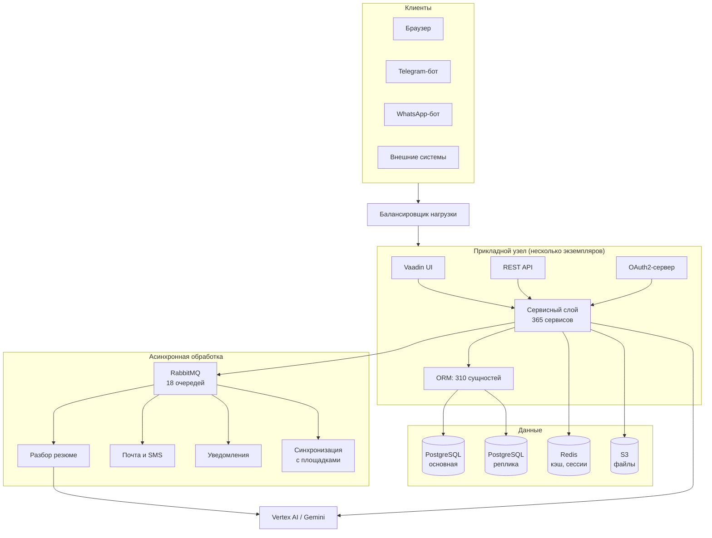
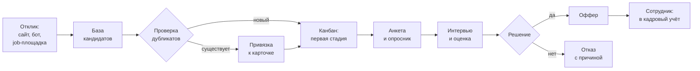
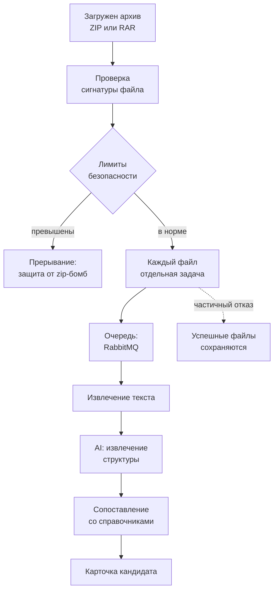

**Русский** | [O'zbekcha](README.md)

# Jobster 4.0

**HR-платформа полного цикла для Узбекистана: от подбора кандидатов
до кадрового учёта и аналитики.**

Jobster работает в промышленной эксплуатации и обслуживает крупные компании
с распределённой филиальной структурой. Система работает на трёх языках
(узбекский, русский, английский), учитывает местные job-площадки,
SMS-провайдеров и требования к хранению данных.

Технологии: Java 21, Spring Boot, Jmix 2.x, Vaadin, PostgreSQL, RabbitMQ,
Redis, Google Vertex AI.

---

## 1. Содержание

1. [Содержание](#1-содержание)
2. [Скриншоты](#2-скриншоты)
3. [Возможности](#3-возможности)
4. [Зачем нужна локальная платформа](#4-зачем-нужна-локальная-платформа)
5. [Архитектура](#5-архитектура)
6. [Как устроены ключевые процессы](#6-как-устроены-ключевые-процессы)
7. [Мультитенантность и безопасность](#7-мультитенантность-и-безопасность)
8. [Интеграции](#8-интеграции)
9. [Масштаб и инженерные метрики](#9-масштаб-и-инженерные-метрики)
10. [Сравнение с зарубежными ATS](#10-сравнение-с-зарубежными-ats)
11. [Что опубликовано в этом репозитории](#11-что-опубликовано-в-этом-репозитории)
12. [Доступ для жюри](#12-доступ-для-жюри)
13. [Лицензия](#13-лицензия)

---

## 2. Скриншоты

### Панель управления

Ключевые показатели для рекрутёра и руководителя: открытые вакансии,
активные заявки, кандидаты в резерве, средний срок закрытия вакансии,
распределение по воронке и разрез по источникам.

*Снимок сделан на демо-стенде, поэтому часть показателей нулевая.*

### Воронка кандидатов

Канбан-доска: кандидат движется по стадиям, стадии настраиваются под процесс
конкретной компании. На карточке видны опыт, подразделение, срок и следующий шаг.

### Вакансии

Список вакансий с подразделением, филиалом, автором, согласующим
и датой проверки.

### База кандидатов

Единая база кандидатов с фильтрацией по вакансии, подразделению, должности,
контактам и статусу.

### Массовый разбор резюме

Рекрутёр загружает архив с сотнями резюме (ZIP или RAR, до 100 резюме),
система распаковывает его, извлекает текст и с помощью искусственного
интеллекта превращает в заполненные карточки кандидатов.

### Организационная структура

Дерево филиалов и подразделений: регионы, юрлица, отделы и их иерархия.

### Справочник должностей

Единый справочник должностей и их сопоставление с профессиями внешних
job-площадок.

*На снимках персональные данные скрыты. Все снимки сделаны на демо-стенде.*

---

## 3. Возможности

### Подбор персонала

- Заявка на подбор и маршрут её согласования (двухшаговое утверждение)
- Вакансии и их публикация на внешних площадках
- Канбан-воронка с настраиваемыми стадиями
- База кандидатов, поиск дубликатов, история взаимодействий
- Массовая загрузка резюме (PDF, DOCX, ZIP, RAR) и разбор через AI
- Анкеты и опросники, конструктор форматов ответов
- Интервью, оценки, причины отказа
- Кадровый резерв и его отслеживание по стадиям

### Кадровый учёт

- Организационная структура: юрлица, филиалы, отделы, должности
- Штатное расписание и его укомплектованность
- Личные дела сотрудников, документы, паспортные данные
- Табель, учёт присутствия, причины отсутствия
- Обучение и группы стажёров
- Процесс увольнения и exit-интервью

### Платформа

- Мультитенантность: изоляция данных между компаниями-клиентами
- Ролевая модель на уровне сущностей, атрибутов и экранов (11 ролей)
- 51 готовый отчёт, экспорт в Excel и PDF
- Модуль автоматизации процессов (`robot`): конструктор условий,
  автоматические действия при переходе по стадиям
- REST API и OAuth2-сервер авторизации
- Корпоративный SSO: SAML и провижининг пользователей через SCIM
- Отдельный сайт вакансий для каждого клиента на своём домене
- Боты Telegram и WhatsApp

---

## 4. Зачем нужна локальная платформа

Зарубежные ATS не закрывают три требования рынка Узбекистана.

**Язык.** Интерфейс и все справочники должны быть на узбекском, включая
сообщения, которые уходят кандидату. Узбекская локализация у нас занимает
5 613 строк и не ограничивается подписями интерфейса: переведены
справочники, шаблоны писем и сообщения ботов.

**Локальные каналы.** Связь с кандидатом идёт через SMS и Telegram,
а не через электронную почту. Поэтому интеграции с местными
SMS-провайдерами (Eskiz, Aurum Stella) и Telegram-ботом это основной
канал, а не дополнительная возможность.

**Хранение данных.** Система обрабатывает персональные данные граждан,
поэтому должна размещаться на серверах в Узбекистане и соответствовать
местным требованиям.

Кроме того, местная практика кадрового учёта (штатное расписание, табель,
филиальная структура) отличается от модели зарубежных ATS: они, как
правило, покрывают только процесс подбора.

---

## 5. Архитектура

Jobster это монолит с асинхронной периферией. Это осознанный выбор.

HR-процессы жёстко связаны между собой: кандидат становится сотрудником,
сотрудник попадает в штатное расписание, штатное расписание влияет
на заявку на подбор. Разрезать это на микросервисы означало бы превратить
каждую транзакцию в распределённую сагу и получить проблему согласованности
данных на пустом месте.

Поэтому ядро единое и транзакционное, а всё, что можно вынести за пределы
пользовательского запроса, вынесено в очереди.

Структура пакетов:

| Пакет | Назначение |
|---|---|
| `entity` | Доменная модель, 310 сущностей |
| `view` | Экраны интерфейса, 427 классов |
| `service` | Бизнес-логика, 365 сервисов |
| `controller` | REST API, 39 контроллеров |
| `listener` | События сущностей и очередей, 45 штук |
| `job` и `config/cron` | Планировщик, 28 задач |
| `robot` | Движок автоматизации процессов |
| `security` | Роли и политики доступа |
| `bot` | Боты Telegram и WhatsApp |

---

## 6. Как устроены ключевые процессы

### Путь кандидата

К каждой стадии можно привязать автоматические действия: отправить
сообщение, выдать анкету, назначить ответственного, отследить срок.
Этим занимается модуль `robot`.

### Массовый разбор резюме

Лимиты проверяются в процессе распаковки, а не после неё: чтобы архив
на 50 КБ, разворачивающийся в 50 ГБ, не заполнил сервер, контролируются
число файлов, размер после распаковки и коэффициент сжатия.

Код этого модуля опубликован в репозитории полностью:
`src/main/java/com/smartbox/jobster/service/cvparser/batch/`

---

## 7. Мультитенантность и безопасность

Одна инсталляция обслуживает несколько компаний-клиентов. Изоляция данных
обеспечивается на уровне доменной модели, а не фильтрацией в контроллерах:
сущность `Company` является частью модели, а доступ ограничивается
на уровне слоя данных.

Разграничение доступа работает на трёх уровнях:

| Уровень | Что определяет |
|---|---|
| Сущности | Какие типы объектов доступны роли |
| Атрибуты | Какие поля объекта видны и редактируемы |
| Экраны | Какие интерфейсы доступны |

Дополнительно:

- Политика паролей: требования к сложности, срок действия, история
- OAuth2-сервер авторизации с ограничением времени жизни токенов
- Корпоративный SSO: SAML и провижининг через SCIM
- Журнал доступа к данным
- Доступ к файлам через подписанные токены
- Лимиты безопасности для загружаемых архивов

---

## 8. Интеграции

| Направление | С чем |
|---|---|
| Job-площадки | HeadHunter, ishGO |
| Мессенджеры | Telegram-бот, WhatsApp Business API |
| SMS | Eskiz, Aurum Stella |
| Электронная почта | SMTP, Mailgun, Microsoft Outlook (Graph API) |
| Календарь | Google Calendar |
| Документы | Google Sheets |
| Push-уведомления | Firebase Cloud Messaging |
| Искусственный интеллект | Google Vertex AI (Gemini), распознавание речи |
| BI и аналитика | Apache Superset |
| Карты | Google Maps (подбор по территориальной близости) |
| Корпоративные системы | REST API, SAML SSO, SCIM |

---

## 9. Масштаб и инженерные метрики

| Метрика | Значение |
|---|---|
| Строк кода Java | ~226 000 |
| Классов Java | 2 059 |
| Доменных сущностей | 310 |
| Сервисов бизнес-логики | 365 |
| Экранов интерфейса (классов) | 427 |
| Готовых отчётов | 51 |
| REST-контроллеров | 39 |
| Асинхронных очередей | 18 |
| Задач планировщика | 28 |
| Миграций базы данных | 475 |
| Ролей доступа | 11 |
| Строк локализации (узбекский) | 5 613 |
| Языков интерфейса | 3 |

Схема базы версионируется через Liquibase: каждое изменение это отдельный
файл, применяется автоматически при развёртывании, откат выполняется
одной командой.

Наблюдаемость: Prometheus собирает метрики JVM, пула соединений и HTTP,
Sentry принимает ошибки, отдельный контур оповещает о недоступности.

---

## 10. Сравнение с зарубежными ATS

Сравнение основано на публично доступной информации по состоянию
на сентябрь 2026 года.

| Требование | Зарубежные ATS (Greenhouse, Lever, Workable) | Российские ATS (Huntflow, Potok) | Jobster |
|---|---|---|---|
| Узбекский язык | Нет | Нет | Да, полностью |
| Местные SMS-провайдеры | Нет | Нет | Eskiz, Aurum Stella |
| Telegram как основной канал | Ограниченно | Частично | Да |
| Интеграция с ishGO | Нет | Нет | Да |
| Размещение в Узбекистане | Облако за рубежом | Российское облако | В Узбекистане |
| Местный кадровый учёт (штатка, табель) | Нет | Ограниченно | Да |
| Филиальная структура | Ограниченно | Да | Да |

Зарубежные ATS сильны в процессе подбора, но не покрывают кадровый учёт
и не работают с местными каналами. Jobster объединяет обе задачи
в одной системе.

---

## 11. Что опубликовано в этом репозитории

| Опубликовано | Не опубликовано |
|---|---|
| Полная структура системы: все классы и интерфейсы | Реализация методов |
| Сигнатуры всех методов | Миграции базы данных |
| Техническая документация в коде (Javadoc) | Разметка экранов интерфейса |
| Доменная модель | Файлы локализации |
| Модуль разбора резюме в полном объёме | Конфигурация и ключи доступа |

**Репозиторий не собирается и не запускается.** Это осознанное условие
публикации, а не дефект.

Причина не в нежелании показывать код, а в обязательствах. Jobster
обрабатывает персональные данные сотрудников и кандидатов компаний-клиентов:
паспортные данные, контакты, историю трудоустройства. Договоры с клиентами
содержат обязательства по конфиденциальности и защите этих данных.

Публикация серверного кода вместе с логикой разграничения доступа означает
публикацию готовой карты для атаки на промышленную среду, где эти данные
хранятся.

Поэтому опубликовано то, что позволяет оценить работу, но не создаёт риска
для данных: полная структура системы, её масштаб, архитектурные решения,
техническая документация и один модуль целиком в качестве образца кода.

---

## 12. Доступ для жюри

Если для оценки требуется больший объём, мы готовы предоставить его
в закрытом формате:

1. доступ на чтение к приватному репозиторию для конкретных экспертов,
   при необходимости с подписанием соглашения о неразглашении;
2. доступ к демонстрационному стенду с тестовыми данными;
3. техническое интервью с командой разработки, включая разбор любого
   участка кода в режиме демонстрации экрана.

Напишите нам, и мы организуем это в течение рабочего дня.

---

## 13. Лицензия

Проприетарная, все права защищены. Код опубликован исключительно
для ознакомления и конкурсной оценки. Использование, копирование,
модификация и создание производных работ не разрешаются.
См. файл `LICENSE`.
